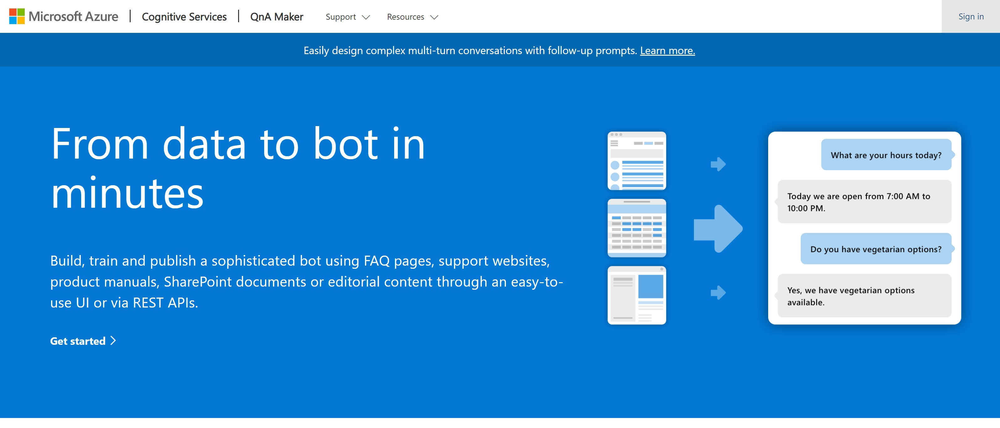
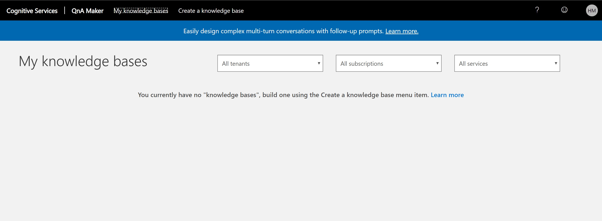
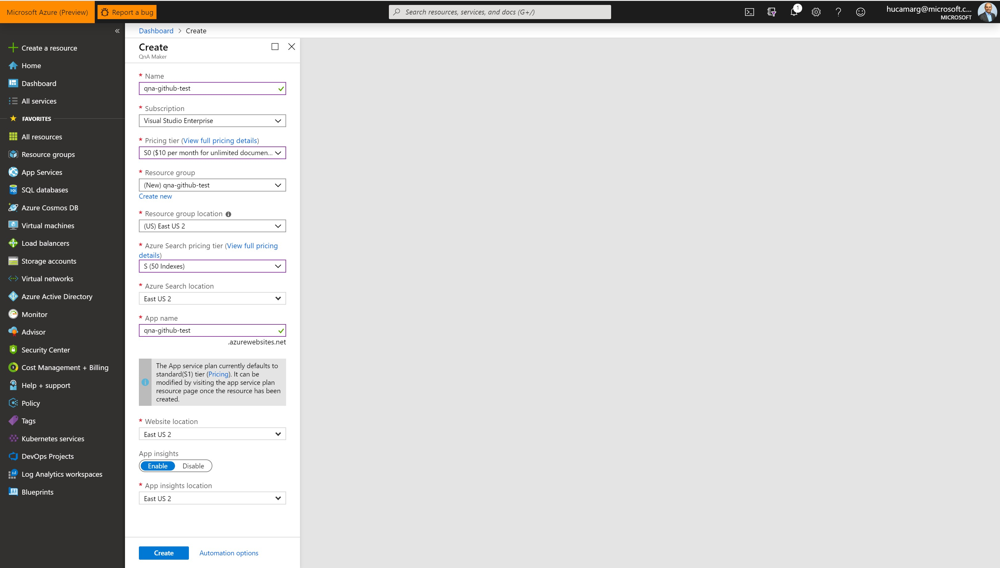
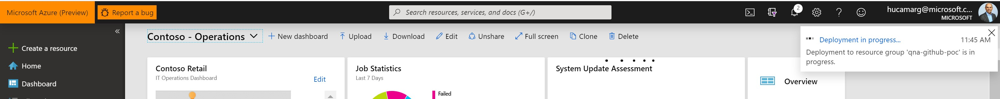
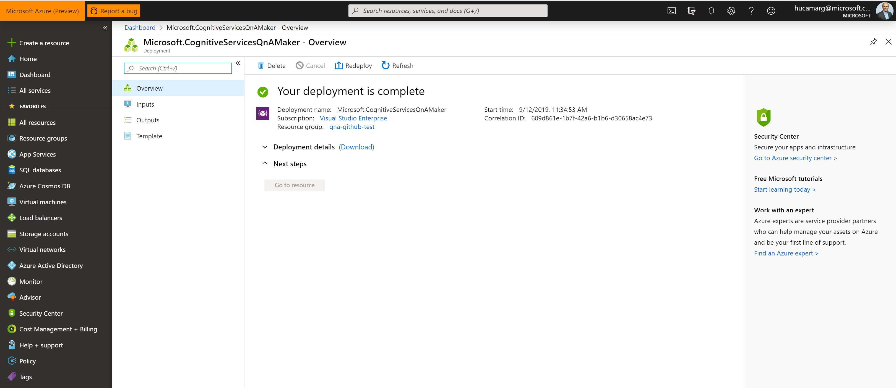
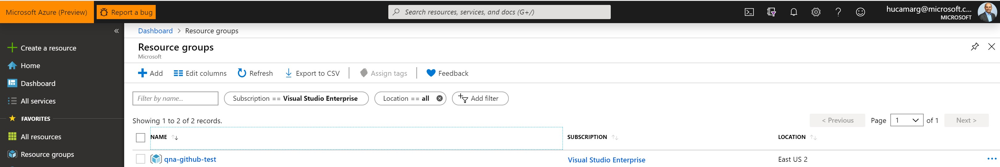
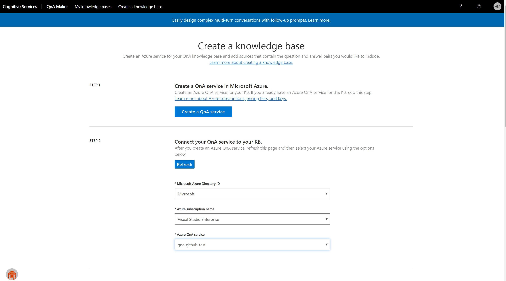
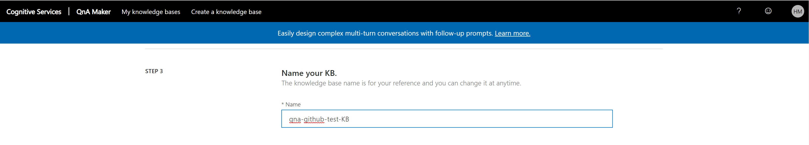
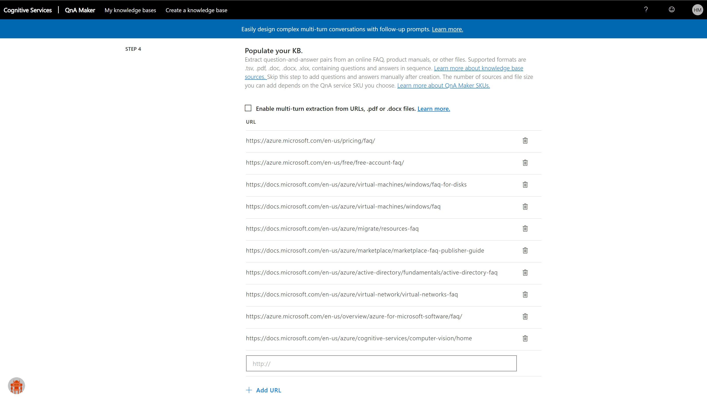
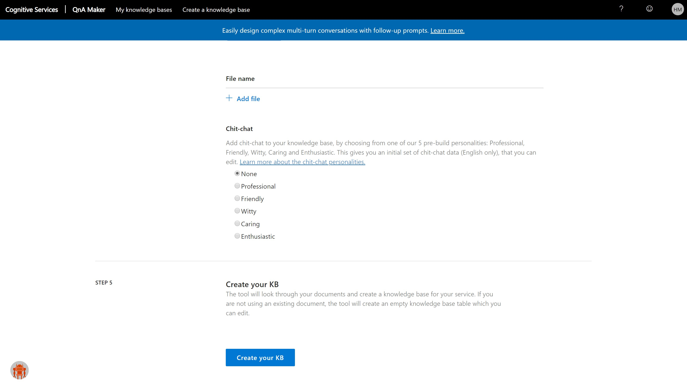

# Cognitive Services Directory - QnAMaker
Cognitive Services Directory using QnAMaker and Bing Search

* Before to Start
Before to dig in on the details on the QnA Bot Services, please take time to explore the Azure Cognitive Services [here](https://azure.microsoft.com/en-us/try/cognitive-services/my-apis/).

* Pre Requisite:
•	Have an Azure Subscription (See here how to create one – you can start with a free subscription);
•	Install Bot Framework Emulator version 4;

## Step 1: Check the Subscription

* 1.1 Subscription
In this scenario, a subscription named `Visual Studio Enterprise` was created.
As soon as you login at your azure subscription, on the website: https://ms.portal.azure.com, click on Resource Groups (left Blade) and see that it’s a empty page (leave this as is for now)

  

## Step 2: Access the QnA Maker

* 2.1 Access the `QnA Maker website`
Access the website https://www.qnamaker.ai/ using your preferable web browser 

* 2.2 Login
Login in the QnA Makaer with your Azure Credentials that you already have or just created on the previous step.

Subscription

  

## Step 3: Creating a Knowledge bases

* 3.1 Knowledge bases
Click on `My Knowledge bases` and see that you have no KB (Knowledge bases) created yet.

  

* 3.2 Click on `Create a knowledge base` Tab

  

* 3.4 Create a QnA service
Click on `Create a QnA service` blue bottom.
The QnA Maker API service portal makes it simple to add your existing data sources when creating a knowledge base. You can create a new QnA Maker knowledge base from the following document types:
•	FAQ pages
•	Products manuals
•	Structured documents
Include a chit-chat personality to make your knowledge more engaging with your users.

  

Use the following reference for your QnA Maker:

For the Azure Search pricing Tier, check this [page](https://azure.microsoft.com/en-us/pricing/details/search/) for details.

| Setting       | Suggested value |  Description   |
| ------------- |  -------------  |  -------------  |            
| QnA Maker   |  Your bot's display name  |      The display name for the bot that appears in channels and directories.            |
| Subscription  |  Your subscription   |        Select the Azure subscription you want to use.         |
| Pricing tier  |  S0  |       Select a pricing tier. You may update the pricing tier at any time. Check this [page](https://azure.microsoft.com/en-us/pricing/details/cognitive-services/qna-maker/) for details.          |
| Resource Group  |  QnA-Githug-Test   |       You can create a new resource group or choose from an existing one. Check [here](https://docs.microsoft.com/en-us/azure/azure-resource-manager/resource-group-overview#resource-groups) more details.                     |
| Resource Group Location  |  EAST-US2   |        Select the geographic location for your resource group. Your location choice can be any location listed, though it's often best to choose a location closest to your customer. The location cannot be changed once the bot is created.         |
| Azure Search Price Tier  |  S (50 Index)   |      View full price details [here](https://azure.microsoft.com/en-us/pricing/details/search/) |
| App name  | A unique name   |       The unique URL name of the bot. For example, if you name your bot myawesomebot, then your bot's URL will be http://myawesomebot.azurewebsites.net. The name must use alphanumeric and underscore characters only. There is a 35 character limit to this field. The App name cannot be changed once the bot is created.          |
| Bot template  |  Echo bot   |      Choose SDK v4. Select either C# or Node.js for this quickstart, then click Select.           |
| App service plan/Location  |  Your app service plan   |         Select an [app service plan](https://azure.microsoft.com/pricing/details/app-service/plans/) location. Your location choice can be any location listed, though it's often best to choose the same location as the bot service. |
| Application Insights  |  On  |        Decide if you want to turn [Application Insights](https://docs.microsoft.com/en-us/bot-framework/bot-service-manage-analytics) On or Off. If you select On, you must also specify a regional location. Your location choice can be any location listed, though it's often best to choose the same location as the bot service.|
| Microsoft App ID and password  |  Auto create App ID and password   |  Use this option if you need to manually enter a Microsoft App ID and password. Otherwise, a new Microsoft App ID and password will be created for you in the bot creation process. When creating an app registration manually for the Bot Service, please ensure that the supported account types is set to ‘Accounts in any organizational directory’ or ‘Accounts in any organizational directory and personal Microsoft accounts (e.g. Skype, Outlook.com, Xbox, etc.)’|

* 3.5 Check the Deployment in progress
On the top right corner a message will appear saying `Deployment in progress` – This would take around 10 minutes to have your QnA maker done.

  

Click on `Deployment in progress` and wait until a full message saying `Your deployment is complete`. 

  

* 3.6 Back to the Resource Group
Now, back to your Resource Group to check the Resources that were created.

  

Click on `Resource Group` that you created to check the resources there, which includes the Cognitive Service and Search Service.

  

## Step 4: Back to the QnA maker website

* 4.1 Select the Azure QnA service
Back to your QnA maker webpage (your previous browser tab) and check the Step 2. 
Click the `Refresh` and select the `Microsoft Azure Directory`, your `Azure Subscription` (used to created the QnA Makaer on the step before) and the `Azure QnA service` that you just created.

  

* 4.2 Name your KB
The `KB` (knowledge base) name is for your reference and you can change it at anytime. In this example designed, I used the name `qna-github-test`

  

* 4.3 Populate your KB
Extract question-and-answer pairs from an online FAQ, product manuals, or other files. Supported formats are .tsv, .pdf, .doc, .docx, .xlsx, containing questions and answers in sequence. Skip this step to add questions and answers manually after creation. The number of sources and file size you can add depends on the QnA service SKU you choose. 

Enter the reference FAQ url on the Link and click `+ Add URL`. In this example, I have included 10 url’s.

  

You can add your file containing FAQ at this step as well.

Please find here the url’s references used in this example.
* https://www.microsoft.com/en-us/software-download/faq
* https://azure.microsoft.com/en-us/pricing/faq/
* https://azure.microsoft.com/en-us/free/free-account-faq/
* https://azure.microsoft.com/en-us/free/free-account-students-faq/
* https://docs.microsoft.com/en-us/azure/virtual-machines/windows/faq-for-disks
* https://docs.microsoft.com/en-us/azure/virtual-machines/windows/faq
* https://docs.microsoft.com/en-us/azure/migrate/resources-faq
* https://docs.microsoft.com/en-us/azure/marketplace/marketplace-faq-publisher-guide
* https://docs.microsoft.com/en-us/azure/active-directory/fundamentals/active-directory-faq
* https://docs.microsoft.com/en-us/azure/virtual-network/virtual-networks-faq
* https://azure.microsoft.com/en-us/overview/azure-for-microsoft-software/faq/
* https://azure.microsoft.com/en-us/services/
* https://docs.microsoft.com/en-us/azure/cognitive-services/computer-vision/home

* 4.4 Create the KB

Click in `Create your KB` (knowledge Base).

  

