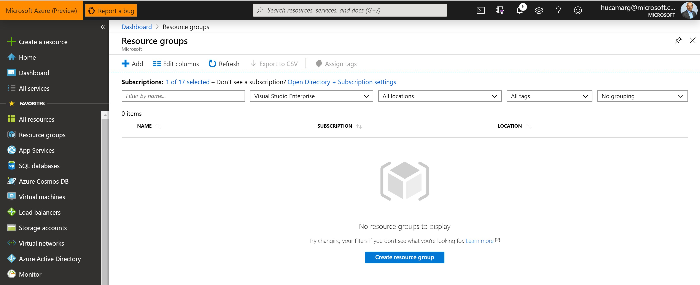

# Cognitive Services Directory - QnAMaker
Cognitive Services Directory using QnAMaker and Bing Search

* Before to Start
Before to dig in on the details on the QnA Bot Services, please take time to explore the Azure Cognitive Services [here](https://azure.microsoft.com/en-us/try/cognitive-services/my-apis/).

* Pre Requisite:
•	Have an Azure Subscription (See here how to create one – you can start with a free subscription);
•	Install Bot Framework Emulator version 4;

## Step 1: Check the Subscription

* 1.1 Subscription
In this scenario, a subscription named “Visual Studio Enterprise” was created.
As soon as you login at your azure subscription, on the website: https://ms.portal.azure.com, click on Resource Groups (left Blade) and see that it’s a empty page (leave this as is for now)

  

## Step 2: Access the QnA Maker

* 2.1 Access the QnA Maker website
Access the website https://www.qnamaker.ai/ using your preferable web browser 

* 2.2 Login
Login in the QnA Makaer with your Azure Credentials that you already have or just created on the previous step.

Subscription

  

## Step 3: Creating a Knowledge bases

* 3.1 Knowledge bases
Click on “My Knowledge bases” and see that you have no KB (Knowledge bases) created yet.

  

* 3.2 Click on “Create a knowledge base” Tab

  

* 3.4 Create a QnA service
Click on “Create a QnA service” blue bottom.
The QnA Maker API service portal makes it simple to add your existing data sources when creating a knowledge base. You can create a new QnA Maker knowledge base from the following document types:
•	FAQ pages
•	Products manuals
•	Structured documents
Include a chit-chat personality to make your knowledge more engaging with your users.

  

Use the following reference for your QnA Maker:

For the Azure Search pricing Tier, check this [page](https://azure.microsoft.com/en-us/pricing/details/search/) for details.

| Setting       | Suggested value |  Description   |
| ------------- |  -------------  |  -------------  |            
| QnA Maker   |  Content Cell   |                 |
| Subscription  |  Content Cell   |                 |
| Pricing tier  |  Content Cell   |                 |
| Resource Group  |  Content Cell   |                 |
| Resource Group Location  |  Content Cell   |                 |
| Azure Search Price Tier  |  Content Cell   |                 |
| App name  |  Content Cell   |                 |
| Bot template  |  Content Cell   |                 |
| App service plan/Location  |  Content Cell   |                 |
| Application Insights  |  Content Cell   |                 |
| Microsoft App ID and password  |  Content Cell   |                 |
