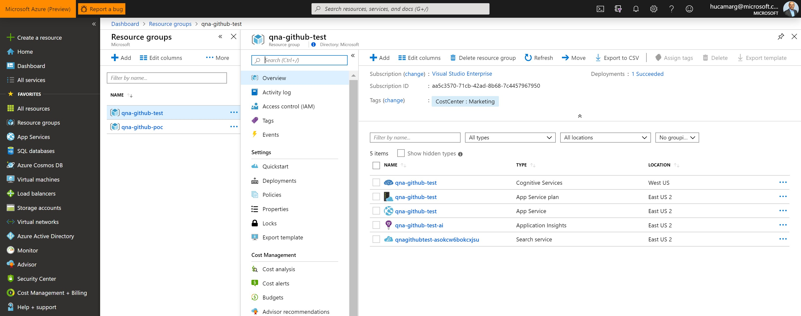
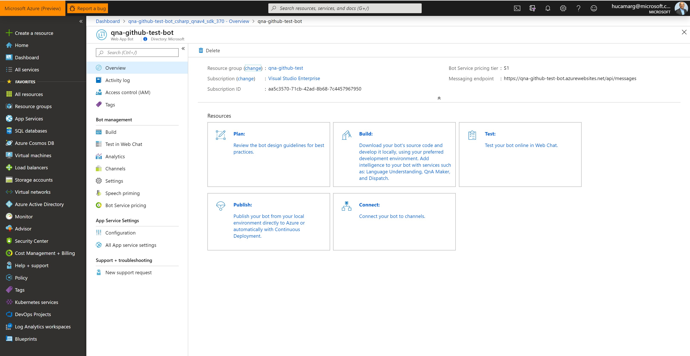
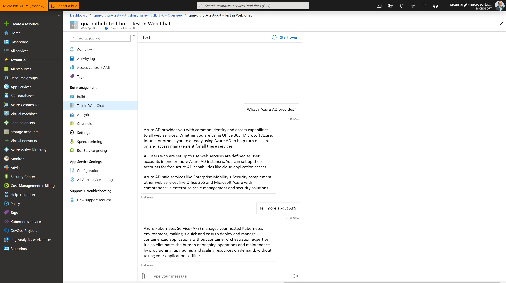
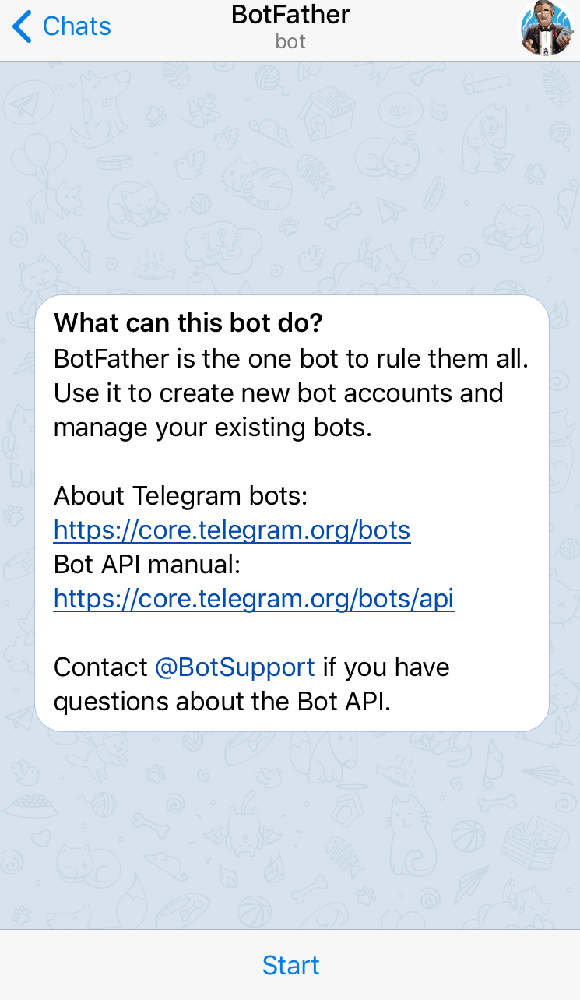
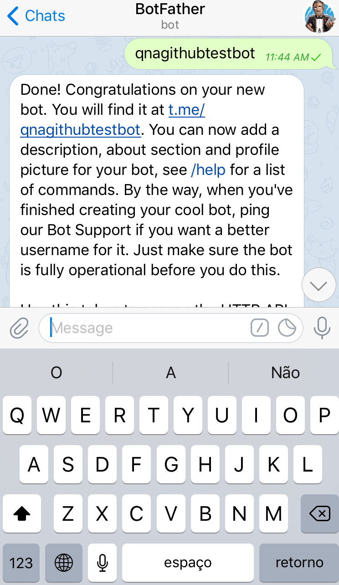
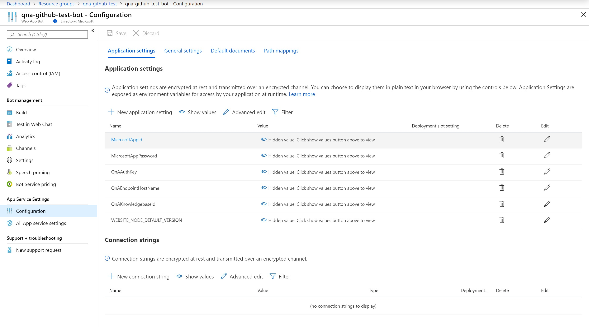

# Cognitive Services - QnAMaker
Cognitive Services Directory using QnAMaker and Bing Search

* Before to Start with the details on the QnA Bot Services, please take time to explore the Azure Cognitive Services [here](https://azure.microsoft.com/en-us/try/cognitive-services/my-apis/).

* Pre Requisite, please find below:

1 - *Azure Subscription*;;

2 - *Install Bot Framework Emulator version 4;*

3 - *Teams Installed; (Optional)*

4 - *Telegram; (Optional)*

## Step 1: Check the Subscription

* 1.1 Subscription

In this scenario, a subscription named `Visual Studio Enterprise` was created;
As soon as you login at your azure subscription, on the website: https://ms.portal.azure.com, click on Resource Groups (left Blade) and see that it’s a empty page (leave this as is for now)

  

## Step 2: Access the QnA Maker

* 2.1 Access the `QnA Maker website`

Access the website https://www.qnamaker.ai/ using your preferable web browser 

* 2.2 Login

Login in the QnA Makaer with your Azure Credentials that you already have or just created on the previous step.

Subscription

  

## Step 3: Creating a Knowledge bases

* 3.1 Knowledge bases

Click on `My Knowledge bases` and see that you have no KB (Knowledge bases) created yet.

  

* 3.2 Click on `Create a knowledge base` Tab

  

* 3.4 Create a QnA service

Click on `Create a QnA service` blue bottom.
The QnA Maker API service portal makes it simple to add your existing data sources when creating a knowledge base. You can create a new QnA Maker knowledge base from the following document types:
•	FAQ pages
•	Products manuals
•	Structured documents
Include a chit-chat personality to make your knowledge more engaging with your users.

  

Use the following reference for your QnA Maker:

For the Azure Search pricing Tier, check this [page](https://azure.microsoft.com/en-us/pricing/details/search/) for details.

| Setting       | Suggested value |  Description   |
| ------------- |  -------------  |  -------------  |            
| QnA Maker   |  Your bot's display name  |      The display name for the bot that appears in channels and directories.            |
| Subscription  |  Your subscription   |        Select the Azure subscription you want to use.         |
| Pricing tier  |  S0  |       Select a pricing tier. You may update the pricing tier at any time. Check this [page](https://azure.microsoft.com/en-us/pricing/details/cognitive-services/qna-maker/) for details.          |
| Resource Group  |  QnA-Githug-Test   |       You can create a new resource group or choose from an existing one. Check [here](https://docs.microsoft.com/en-us/azure/azure-resource-manager/resource-group-overview#resource-groups) more details.                     |
| Resource Group Location  |  EAST-US2   |        Select the geographic location for your resource group. Your location choice can be any location listed, though it's often best to choose a location closest to your customer. The location cannot be changed once the bot is created.         |
| Azure Search Price Tier  |  S (50 Index)   |      View full price details [here](https://azure.microsoft.com/en-us/pricing/details/search/) |
| App name  | A unique name   |       The unique URL name of the bot. For example, if you name your bot myawesomebot, then your bot's URL will be http://myawesomebot.azurewebsites.net. The name must use alphanumeric and underscore characters only. There is a 35 character limit to this field. The App name cannot be changed once the bot is created.          |
| Bot template  |  Echo bot   |      Choose SDK v4. Select either C# or Node.js for this quickstart, then click Select.           |
| App service plan/Location  |  Your app service plan   |         Select an [app service plan](https://azure.microsoft.com/pricing/details/app-service/plans/) location. Your location choice can be any location listed, though it's often best to choose the same location as the bot service. |
| Application Insights  |  On  |        Decide if you want to turn [Application Insights](https://docs.microsoft.com/en-us/bot-framework/bot-service-manage-analytics) On or Off. If you select On, you must also specify a regional location. Your location choice can be any location listed, though it's often best to choose the same location as the bot service.|
| Microsoft App ID and password  |  Auto create App ID and password   |  Use this option if you need to manually enter a Microsoft App ID and password. Otherwise, a new Microsoft App ID and password will be created for you in the bot creation process. When creating an app registration manually for the Bot Service, please ensure that the supported account types is set to ‘Accounts in any organizational directory’ or ‘Accounts in any organizational directory and personal Microsoft accounts (e.g. Skype, Outlook.com, Xbox, etc.)’|

* 3.5 Check the Deployment in progress

On the top right corner a message will appear saying `Deployment in progress` – This would take around 10 minutes to have your QnA maker done.

  

Click on `Deployment in progress` and wait until a full message saying `Your deployment is complete`. 

  

* 3.6 Back to the Resource Group

Now, back to your Resource Group to check the Resources that were created.

  

Click on `Resource Group` that you created to check the resources there, which includes the Cognitive Service and Search Service.

  

## Step 4: Back to the QnA maker website

* 4.1 Select the Azure QnA service

Back to your QnA maker webpage (your previous browser tab) and check the Step 2. 
Click the `Refresh` and select the `Microsoft Azure Directory`, your `Azure Subscription` (used to created the QnA Makaer on the step before) and the `Azure QnA service` that you just created.

  

* 4.2 Name your KB
The `KB` (knowledge base) name is for your reference and you can change it at anytime. In this example designed, I used the name `qna-github-test`

  

* 4.3 Populate your KB

Extract question-and-answer pairs from an online FAQ, product manuals, or other files. Supported formats are .tsv, .pdf, .doc, .docx, .xlsx, containing questions and answers in sequence. Skip this step to add questions and answers manually after creation. The number of sources and file size you can add depends on the QnA service SKU you choose. 

Enter the reference FAQ url on the Link and click `+ Add URL`. In this example, I have included 10 url’s.

  

You can add your file containing FAQ at this step as well.

Please find here the url’s references used in this example.
* https://www.microsoft.com/en-us/software-download/faq
* https://azure.microsoft.com/en-us/pricing/faq/
* https://azure.microsoft.com/en-us/free/free-account-faq/
* https://azure.microsoft.com/en-us/free/free-account-students-faq/
* https://docs.microsoft.com/en-us/azure/virtual-machines/windows/faq-for-disks
* https://docs.microsoft.com/en-us/azure/virtual-machines/windows/faq
* https://docs.microsoft.com/en-us/azure/migrate/resources-faq
* https://docs.microsoft.com/en-us/azure/marketplace/marketplace-faq-publisher-guide
* https://docs.microsoft.com/en-us/azure/active-directory/fundamentals/active-directory-faq
* https://docs.microsoft.com/en-us/azure/virtual-network/virtual-networks-faq
* https://azure.microsoft.com/en-us/overview/azure-for-microsoft-software/faq/
* https://azure.microsoft.com/en-us/services/
* https://docs.microsoft.com/en-us/azure/cognitive-services/computer-vision/home

* 4.4 Create the KB

Click in `Create your KB` (knowledge Base).

  

As soon as you click in create, this will take few minutes to have your KB ready.

  

As soon as you have created the KB, you will have access to edit the KB. As you can see in the picture below, the KB was created and is ready to be edited if is needed. 

  

* 4.4 Add QnA Pair

For the test proposal, click in `+ Add QnA Pair`.

In this example, I used the following (see the picture below to see where to edit the QnA

What is Azure Kubernetes Service (AKS)?
Azure Kubernetes Service (AKS) manages your hosted Kubernetes environment, making it quick and easy to deploy and manage containerized applications without container orchestration expertise. It also eliminates the burden of ongoing operations and maintenance by provisioning, upgrading, and scaling resources on demand, without taking your applications offline.

  

* 4.5 Save

Now click in `Save and train` your QnA model.

  

  

* 4.6 Test

Let’s test your QnA Model before to publish. Click in -> `Test` (blue button). 
Ask about AKS to see the answer on the chat window.

  

* 4.7 Publish

Now is time to test your environment. Click on Publish Tab and then, Publish (blue button)

  

  

The publish process will take less then 1 minute to be done. A Success page will be displayed. Done, your QnA is ready to be consumed. 

  

## Step 5: Create your Bot

* Step 5.1 Click on Create your Bot

Click on `Create your Bot`

  

* Step 5.2 Bot Data 

You will be redirect to the ms.azure.portal and click in create after to check the date there. (be sure that you have your qna and bot on the same resource group)
For this step, we will create a Bo on the Azure Portal (Just click on the Create Bot – Really important to create from here as all parameters will be automatic populated on Azure Portal (as you can see on the picture below (as the QnA Auth Key)

  

Wait until the deployment is completed.

  

* Step 5.3 Back to Resource Group

It’s time to back to Resource Groups in order to see what you have deployed so far. 
Click on `Resource Groups` on the left Blade and then on the Resource Group that you created before, in this scenario, I used the name `qna-github-test`.

  

* Step 5.4 Web App Bot

Once there, you will be able to find all services created and see the type of each services. The Web App Bot is where we will work on the Chat Bot and the Channels integration. 
Click on the `Web App Bot`, in my scenario, I called it `qna-github-test-bot`.

  

* Step 5.5 Test the integration

Now, your Web App Bot is ready. In order to test the integration between the Web App Bot and the QnA that you created, click on Test in Web Chat.

  

* Step 5.6 Test a question 

Ask about the AKS or any another Azure question that you have to test your system. Ask your question on “Type your message  and send it ->

  

* Step 5.7 Test the Integration Channels. 

Click on `Channels`, under Bot management. Click on `Teams` Logo, under the Add a feature channel.

  

* Step 5.8 Save

Click in Save

  

Work on the Terms of Service. 

  

* Step 5.9 Connect to channels

After that, the Microsoft Teams will be available at the Connect to channels. Click on the `Microsoft Teams`.

  

Another chat window will be opened and you will be able to see the Teams Chat to start to ask your questions.

  

In the example below, 2 questions were made. Check the answers and if is needed, back to your qnamaker home page to adjust the answer.

  

## Step 6: Integration with another Channels (Telegram)

Another possibility here is to integrate with Telegram, for example. 

* Step 6.1 Backing to the `Channels`, select Telegram (under `more channels`)

  

* Step 6.2 Create Telegram

If you don’t have one, create your Telegram account using your mobile phone number. 
I will not cover these steps but basically, download the Telegram from your Mobile Marketplace, install and follow the steps to activate based on the SMS confirmation number that you will receive.

* Step 6.3 Bot Father

Create a new Telegram bot using the Bot Father. See the picture below. In your Telegram, look for `BotFather`.

  

* Step 6.4 Newbot

To create a new Telegram bot, send command `/newbot`.

  

* Step 6.5 Give a name

Give the Telegram bot a friendly name. In this scenario, I’ve used the name qna-github-test.

  

* Step 6.6 Username

Give the Telegram bot a unique username. In this scenario, I’ve used the name qna-github-test-bot

  

* Step 6.7 Token

Paste the token you copied previously into the Access Token field and click Save.

  

* Step 6.8 Ready to start to use your Bot using Telegram

Now, you can back to your Telegram, find the room that you just created and start to chat!

  

## Step 7: Bot Framework Emulator

* Step 7.1 Install the ChatBot Emulator

Now, we will access the ChatBot using the Bot Framework Emulator (V4) that you have to install in your Desktop/Laptop. Find here the page to download the Bot Framework Emulator: https://github.com/Microsoft/BotFramework-Emulator

After the Bot Framework Emulator installed, launch the Bot Framework Emulator at your computer and `login at Azure` using your account used to access the Azure Portal (the same used on the first step of this tutorial)

  

  

* Step 7.2 Configure the Bot Framework Emulator

Access the `Resource Group` that you created, access the `qna-github-test-bot` Web App Bot and copy the `Messaging endpoint` address. Save this information in a clipboard.

  

Addtionally, access the `App Service Settings` under `Configurations` and copy 2 informations there (that will be used on the next step:
* `MicrosoftAppId`
* `MicrosoftAppPassword`
In order to have access to the key, just click on top of each paraemter.

  

* Step 7.3 Copy the information on the Bot Framework Emulator

Now with the 3 informations in hand, back to the Framework Bot Emulator and connect your Bot.
* `Messaging endpoint`
* `MicrosoftAppId`
* `MicrosoftAppPassword`

  

* Step 7.4 Test your Framework Bot Emulator

  

