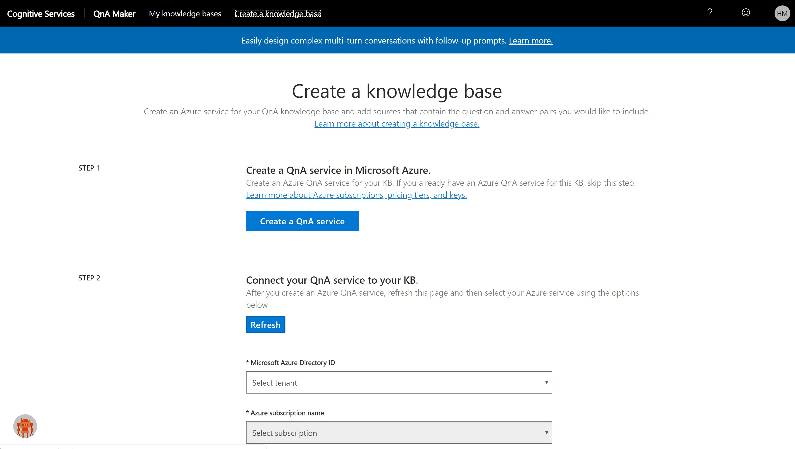

# SQL-Managed Instance / Disaster Recovery Architecture 
# Step by Step Implementation

SQL Managed Instance Installation process - Step by Step to Disaster Recovery - Ready for Massive roll out 

This document provide the Best Practice guidence for the SQL-Managed Instance implementation considering a Disaster Recovery Architecture with a full Failover Group configured.

The entire process can be implemented by Azure Resource Manager configuration, Powershell, ARM Templates or Infrastructure as a Code using Terraform. This Step by Step guide covers the first scenario which is using Azure Resouce Manager.

In order to undertand the SQL Managed Instance Resource Limits, check [here](https://docs.microsoft.com/en-us/azure/sql-database/sql-database-managed-instance-resource-limits) for more information. Few points to higlight. 
* Gen 4 vs Gen 5;
* Managed instance has two service tiers: General Purpose and Business Critical. These tiers provide different capabilities, as described in this [table](https://docs.microsoft.com/en-us/azure/sql-database/sql-database-managed-instance-resource-limits#service-tier-characteristics).

## Topics that you will work in this guide:
* [End to End Architecture](https://github.com/hcmarque/SQL-Managed-Instance-Disaster-Recovery-Architecture-Design/blob/master/README.md#e2e-architecture)

## Step 1: Main Activity: Create two Resources Groups - SQL-MI and Network
* 1.1 - Create the Resource Group that will be used for both SQL Managed Instances (Primary and Secondary) –  Needs to be under the same Resource Group, otherwise your Failover Group wont work on later step). Click on `Create a Resource Group`

  

* 1.2 - Select the desired `Subscription`, `Resource group` name and `Region`. **Remember** In case of Disaster Recovery design, please consider the Pair regions considerations mentioned E2E Architecture considerations. In this Architecture Desing Example, we will consider EAST-US2 and CENTRAL-US for the Instances.
Now CLick on `Review + Create`.

  

* 1.3 - As soon as you have the Validation passed green light, click on `Create`

  

* 1.4 - Create the Resource Group that will be used for the Network Configurations. Click on `Create a Resource Group` and Select the desired `Subscription`, `Resource group` name and `Region`.
Now CLick on `Review + Create`.

  

* 1.5 - As soon as you have the Validation passed green light, click on `Create`

  

* 1.6 - Resource Group Summary for the SQL-Managed Instance Disaster Recovery Implementation:

  

## Step 2: DDoS Standard Design

* 2.1 DDoS Standard
On the moment to create your network for the SQL-MI, is recommend to enable the DDoS Standard. 
Azure DDoS basic protection is integrated into the Azure platform by default and at no additional cost. 
Azure DDoS standard protection is a premium paid service that offers enhanced DDoS mitigation capabilities via adaptive tuning, attack notification, and telemetry to protect against the impacts of a DDoS attack for all protected resources within this virtual network.

# Cognitive Services Directory - QnAMaker
Cognitive Services Directory using QnAMaker and Bing Search

* Before to Start
Before to dig in on the details on the QnA Bot Services, please take time to explore the Azure Cognitive Services [here](https://azure.microsoft.com/en-us/try/cognitive-services/my-apis/).

* Pre Requisite:
•	Have an Azure Subscription (See here how to create one – you can start with a free subscription);
•	Install Bot Framework Emulator version 4;

## Step 1: Check the Subscription

* 1.1 Subscription
In this scenario, a subscription named “Visual Studio Enterprise” was created.
As soon as you login at your azure subscription, on the website: https://ms.portal.azure.com, click on Resource Groups (left Blade) and see that it’s a empty page (leave this as is for now)

  

## Step 2: Access the QnA Maker

* 2.1 Access the QnA Maker website
Access the website https://www.qnamaker.ai/ using your preferable web browser 

* 2.2 Login
Login in the QnA Makaer with your Azure Credentials that you already have or just created on the previous step.

  

## Step 3: Creating a Knowledge bases

* 3.1 Knowledge bases
Click on “My Knowledge bases” and see that you have no KB (Knowledge bases) created yet.

  

* 3.2 Click on “Create a knowledge base” Tab

  

* 3.4 Create a QnA service
Click on “Create a QnA service” blue bottom.
The QnA Maker API service portal makes it simple to add your existing data sources when creating a knowledge base. You can create a new QnA Maker knowledge base from the following document types:
•	FAQ pages
•	Products manuals
•	Structured documents
Include a chit-chat personality to make your knowledge more engaging with your users.

  

